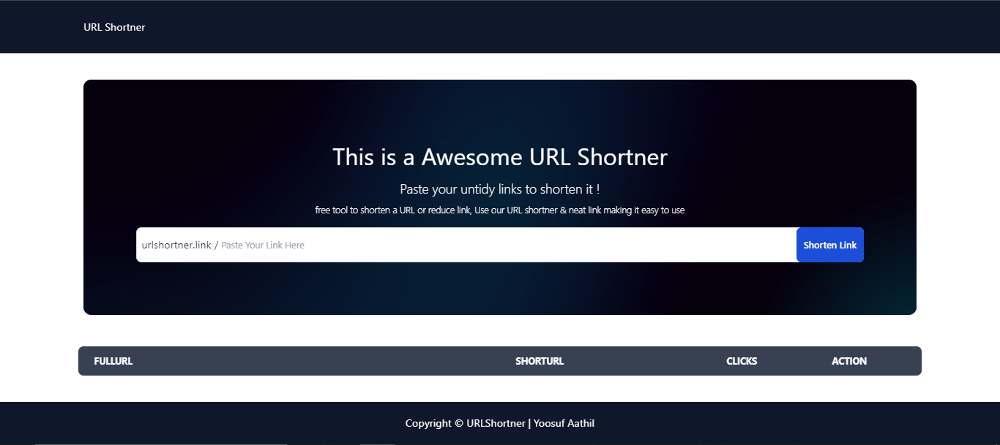

# URL Shortener


This is a full-stack URL Shortener application built using the MERN stack (MongoDB, Express, React, Node.js). The frontend is developed with Vite+React+TypeScript, and the backend uses Node.js, Express, and MongoDB.

## Features

- **Shorten URLs**: Convert long URLs into short, manageable links.
- **Custom URLs**: Create memorable custom short URLs.
- **Analytics**: Track the number of clicks on your shortened URLs.
- **User-Friendly**: Intuitive and easy-to-use interface with Tailwind CSS styling.

## Demo

[Live Demo](#) - _(Replace with your live demo link)_

## Installation

### Prerequisites

- Node.js
- MongoDB
- npm (Node Package Manager)

### Clone the Repository

```sh
git clone https://github.com/your-username/url-shortener.git
cd url-shortener
```

### Install Dependencies

#### Client

```sh
cd client
npm install
```

#### Server

```sh
cd ../server
npm install
```

## Running the App

### Start the Server

```sh
cd server
npm start
```

### Start the Client

```sh
cd ../client
npm run dev
```

## Environment Variables

Create a `.env` file in the `server` directory and add the following environment variables:

```
MONGODB_URI=your_mongodb_connection_string
PORT=5001
```

## Deployment

### Deploying with Vercel

#### Client

1. Sign in to [Vercel](https://vercel.com/).
2. Import the `client` directory from your GitHub repository.
3. Set the framework preset to **Vite**.
4. Set the build command to `npm run build`.
5. Set the output directory to `dist`.
6. Deploy the project.

#### Server

1. Create a new project in Vercel for the `server`.
2. Import the `server` directory from your GitHub repository.
3. Set the framework preset to **Node.js**.
4. Add necessary environment variables (e.g., `MONGODB_URI`).
5. Deploy the project.

## Usage

1. Navigate to the deployed client application.
2. Enter a long URL in the input field.
3. Click "Shorten URL".
4. Use the generated short URL to share and track clicks.

## Contributing

Contributions are welcome! Please open an issue or submit a pull request.

## License

This project is licensed under the MIT License. See the [LICENSE](LICENSE) file for details.
